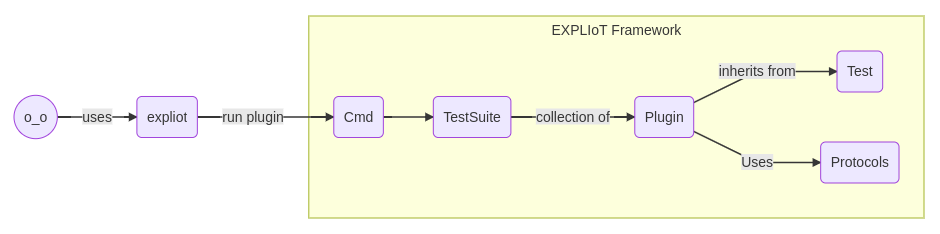

Architecture
============

The architecture, as of now, is kept very simple. I assume as we include new
functionality it may become slightly complex. I would like to think it is
sufficiently object-oriented and component based. The below diagram explains
the major components of the framework which are explained in detail component
wise. Some design considerations are:

#. There should be no external dependency for a plugin except for core Python
   functionality which comes with the standard installation.
#. All the protocol, interface, etc. implementation must reside within the
   framework and is utilized by the plugins.

Design goals
------------

There are three major design goals for the framework:

#. It should be simple to use.
#. It should be extendable.
#. It should be easy to write new plugins (test cases).

Unified interface
-----------------

A unified interface for the plugins was created so they can utilize
everything from within the framework. The benefits are:

#. No external dependency
#. Internal implementation may change at any time, but the framework wrapper
   classes and methods defined in the framework will remain same so plugins
   will not require any code changes.

This is only true for external package. Anything that is part of the
`Python standard library <https://docs.python.org/3/library/index.html>`_
can be used freely i.e. imported and used directly by the plugins.