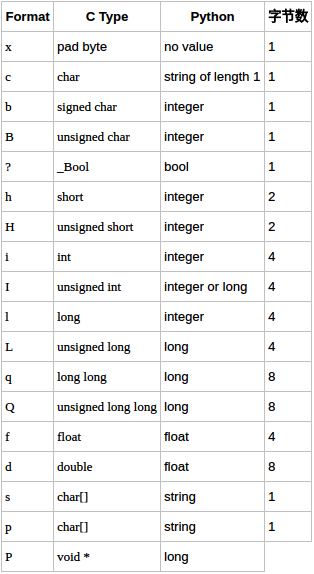

# snap7

1. 从snap7的db里读数

2. index从1开始

3. `H`和`I`分别代表以`2字节`和`4字节`的格式解析数据，数据长度应该是格式的倍数

   > 例子：
   >
   > ```python
   > import struct
   > struct.unpack(">2H", b"\x002\x002")
   > >> (50, 50)
   >
   > """
   > '>2H'
   > > 表示以大序读取数据
   > 2 表示个数
   > H 表示数据读取格式是2字节
   > 2H 就是4字节
   > 所以 2H 等效于 I 4字节
   > """
   > ```
   > **struct支持的格式：每个格式前都可以有一个数字表示个数**
   >
   > **对齐方式：有的c或c++编译器使用了字节对齐，通常是以4个字节为单位的32位系统**
   >
   > **对齐方式的字符应该在格式字符串的第一位**
   >
   > [struct官方文档](https://docs.python.org/3/library/struct.html#format-characters)




